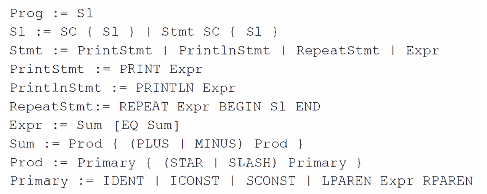

# Programming-languages-and-design
This repository contains code written in my programming languages & design class.  During the semester, we built a simple programming language; I named mine "maXCode." It allows the user to do basic arithmetic, perform string addition and multiplication, define mutable variables, use loops, write comments, and print to the terminal. Below is a description of the language in extended Backus–Naur form (EBNF):

There are also some other assignments sprinkled in.